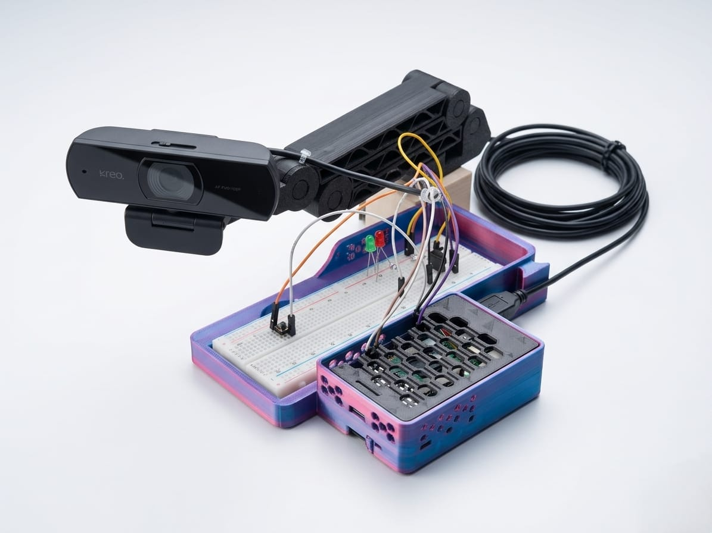

# CrowdSense: Smart Crowd Detection and Management System

<p align="center">
  
</p>

<p align="center">
  
  
  
  
  
</p>

CrowdSense is an edge-first public safety system designed to detect overcrowding and potential stampede conditions in real time. It combines on-device computer vision, physical alert hardware, and a Flutter-based control dashboard so responders can act immediately.

Instead of passive monitoring, CrowdSense actively measures proximity and density using centroid-distance logic on edge devices. When risk thresholds are sustained, the system can trigger alarms, capture evidence, and push emergency notifications.

## Why CrowdSense

- Real-time detection on edge hardware with low latency.
- Works with IoT alerts (LED + buzzer) for instant local response.
- Mobile monitoring dashboard for status, alerts, and visibility.
- Supports safety workflows in campuses, events, stations, and public venues.

## Key Capabilities

- Edge AI inference using Ultralytics YOLO models.
- Stampede-risk logic based on human centroid clustering.
- Sustained-risk window to reduce false positives.
- Emergency workflow integration (alerts + communication hooks).
- Flutter app with Firebase-backed synchronization.
- Optional on-device TFLite model support for mobile-side use cases.

## System Architecture

1. Camera stream is captured on Raspberry Pi.
2. Detection pipeline identifies people and computes centroids.
3. Density/proximity engine scores crowd risk in real time.
4. Alert layer triggers local hardware and cloud notification paths.
5. Flutter dashboard reads live system updates from Firebase.

## Tech Stack

- Computer Vision: Python, OpenCV, Ultralytics YOLO.
- Edge Services: Flask, threading, queue-based processing.
- Mobile App: Flutter, Dart, Firebase Auth/Database/Firestore.
- Notifications: Firebase Messaging, local notifications, Twilio integration hooks.
- Deployment Target: Raspberry Pi 5 + camera + GPIO peripherals.

## Repository Structure

```text
.
|- assets/                  # Image + TFLite model assets
|- docs/                    # Project reports, technical PDFs
|- edge_backend/            # Raspberry Pi / Python edge runtime
|- lib/                     # Flutter application source code
|- android/ ios/ web/ ...   # Flutter platform targets
|- test/                    # Flutter tests
|- pubspec.yaml             # Flutter dependencies and assets
`- README.md
```

## Quick Start

### 1) Clone

```bash
git clone https://github.com/diaschrisfranco2012/Smart-Crowd-Detection-and-Management-System.git
cd Smart-Crowd-Detection-and-Management-System
```

### 2) Flutter App Setup

```bash
flutter pub get
flutter run
```

### 3) Edge Backend Setup (Raspberry Pi)

```bash
cd edge_backend
python3 -m venv .venv
source .venv/bin/activate
pip install opencv-python ultralytics firebase-admin cloudinary twilio flask psutil gpiozero
python3 pi_serverWc5.py
```

Note: On Windows PowerShell, activate venv with `.venv\\Scripts\\Activate.ps1`.

## Hardware Mapping (GPIO)

- Green LED (System Live): GPIO 17
- Red LED (Emergency): GPIO 27
- Active Buzzer: GPIO 22
- Push Button (Control): GPIO 23

## Configuration Checklist

Before production use, configure:

- Firebase service account key file.
- Twilio credentials and destination numbers.
- Cloudinary account details for evidence uploads.
- Device clock/time synchronization (important for auth tokens).

Keep secrets out of source control and rotate credentials regularly.

## Running Modes

- Direct run: `python3 edge_backend/pi_serverWc5.py`
- Launcher-assisted run: use `edge_backend/launcherf.txt` workflow adapted to your deployment script naming.
- Service mode: use `edge_backend/systemed_crowdsense.service.txt` as a systemd template.

## Troubleshooting

- Camera busy: stop stale processes using the camera and retry.
- GPIO stuck after force-stop: perform proper cleanup or controlled restart.
- Firebase auth timestamp errors: verify system date/time.
- Missing alerts: verify current incident lock/reset flow and credentials.
- Overheating or lag: reduce effective FPS, confirm cooling, monitor CPU.

## Documentation

Detailed project docs are available in [`docs/`](docs):

- Smartcrowd Proactive Crowd Safety report.
- Technical documentation PDF.
- Hardware buzzer automation reference.

## Roadmap

- Multi-camera synchronization across zones.
- Predictive crowd-risk forecasting.
- Stronger incident analytics and post-event insights.
- Enhanced fall detection and anomaly fusion.

## Contributing

Contributions are welcome.

1. Fork the repository.
2. Create a feature branch.
3. Make focused, tested changes.
4. Open a clear pull request with before/after behavior.

## Team

Final Year BCA project by Chris Dias, Mevin Quadros, Saieshwar Malkarnekar, Yash Bhandari, and Saheel Shaikh at Rosary College of Commerce & Arts, Goa.

## Support the Project

If this project helps you, please:

- Star the repository.
- Share it with your network.
- Open issues with ideas and improvements.

Built for safer, faster crowd response at the edge.