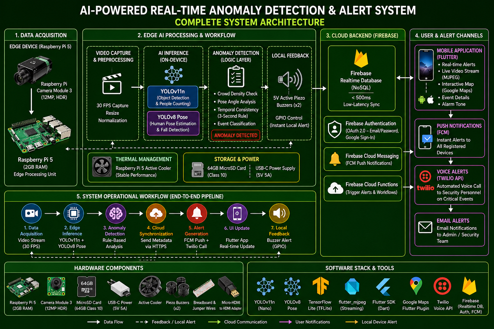
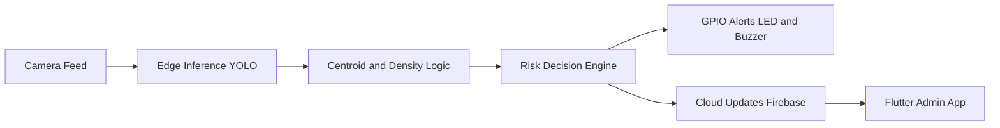
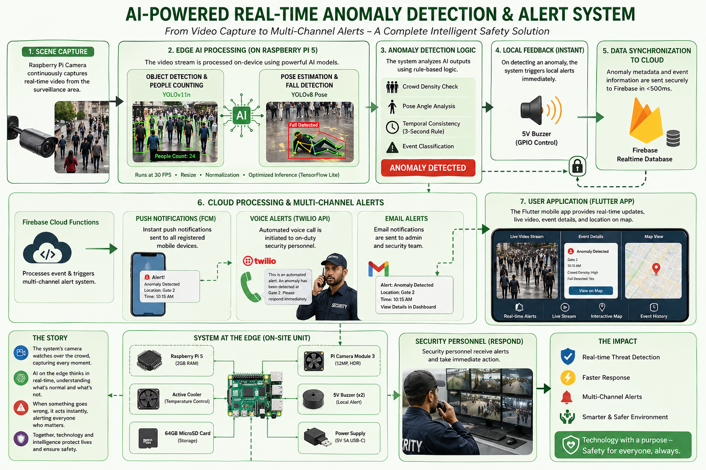

# CrowdSense

<p align="center">
  
</p>

<p align="center">
  <a href="https://github.com/SaieshwarTech/Smart-Crowd-Detection-and-Management-System/stargazers"></a>
  <a href="https://github.com/SaieshwarTech/Smart-Crowd-Detection-and-Management-System/network/members"></a>
  <a href="https://github.com/SaieshwarTech/Smart-Crowd-Detection-and-Management-System/issues"></a>
</p>

<p align="center">
  
  
  
  
  
  
</p>

<p align="center"><b>Smart Crowd Detection and Management System for real-time public safety response.</b></p>

CrowdSense is an edge-first safety platform that detects dangerous crowd density patterns in real time, triggers local hardware alerts, and syncs incident updates to a mobile admin dashboard.

## Contents

- [Why CrowdSense](#why-crowdsense)
- [Highlights](#highlights)
- [Architecture](#architecture)
- [Tech Stack](#tech-stack)
- [Project Structure](#project-structure)
- [Quick Start](#quick-start)
- [GPIO Mapping](#gpio-mapping)
- [Configuration](#configuration)
- [Run Modes](#run-modes)
- [Troubleshooting](#troubleshooting)
- [Documentation](#documentation)
- [Roadmap](#roadmap)
- [Contributing](#contributing)
- [Legal](#legal)

## Why CrowdSense

- Detects crowd-risk conditions on-device with low latency.
- Reduces reliance on passive CCTV observation.
- Triggers immediate local alerts with buzzer and LEDs.
- Provides centralized visibility through a Flutter dashboard.
- Built for campuses, public events, transport hubs, and high-footfall zones.

## Highlights

| Capability | What it does |
|---|---|
| Edge AI Detection | Runs YOLO inference on Raspberry Pi for people detection. |
| Density Risk Logic | Uses centroid proximity clustering to score stampede risk. |
| Alert Workflow | Activates physical alarms and notification hooks on sustained risk. |
| Mobile Dashboard | Displays status, logs, and live operational visibility. |
| Cloud Sync | Uses Firebase channels for near real-time coordination. |

## Parts and Components

<p align="center">
  
</p>

## Architecture



## Workflow

<p align="center">
  
</p>

## Tech Stack

- AI/CV: Python, OpenCV, Ultralytics YOLO
- Edge Runtime: Flask, threading, queue processing
- Mobile: Flutter, Dart
- Cloud: Firebase Auth, Realtime Database, Firestore
- Notifications: Firebase Messaging, local notifications, Twilio hooks
- Hardware: Raspberry Pi 5, camera module, LEDs, buzzer, push button

## Project Structure

```text
.
|- assets/                  # Image + model assets
|- docs/                    # Reports and technical documentation PDFs
|- edge_backend/            # Python edge runtime and hardware scripts
|- lib/                     # Flutter app source code
|- android/ ios/ web/ ...   # Flutter platform targets
|- test/                    # Flutter tests
|- pubspec.yaml             # Flutter dependencies and assets
`- README.md
```

## Quick Start

### 1. Clone

```bash
git clone https://github.com/SaieshwarTech/Smart-Crowd-Detection-and-Management-System.git
cd Smart-Crowd-Detection-and-Management-System
```

### 2. Flutter App

```bash
flutter pub get
flutter run
```

### 3. Edge Backend (Raspberry Pi)

```bash
cd edge_backend
python3 -m venv .venv
source .venv/bin/activate
pip install opencv-python ultralytics firebase-admin cloudinary twilio flask psutil gpiozero
python3 pi_serverWc5.py
```

Windows PowerShell venv activation:

```powershell
.venv\Scripts\Activate.ps1
```

## GPIO Mapping

| Component | GPIO |
|---|---|
| Green LED (System Live) | 17 |
| Red LED (Emergency) | 27 |
| Active Buzzer | 22 |
| Push Button | 23 |

## Configuration

Set these before production deployment:

- Firebase service account key
- Twilio credentials and target numbers
- Cloudinary upload credentials
- Correct device time sync (important for token validation)

Security note: Never commit secrets to GitHub.

## Run Modes

- Direct: `python3 edge_backend/pi_serverWc5.py`
- Launcher workflow: adapt `edge_backend/launcherf.txt` to your deployment script
- Service mode: use `edge_backend/systemed_crowdsense.service.txt` as a systemd template

## Troubleshooting

- Camera busy: stop stale camera processes and rerun.
- GPIO stuck after abrupt stop: perform controlled restart/cleanup.
- Firebase auth errors: verify system date/time.
- Alerts not firing: verify incident-lock flow and credentials.
- Performance lag: reduce FPS load and verify active cooling.

## Documentation

Detailed references are in [`docs/`](docs):

- Smartcrowd Proactive Crowd Safety report
- Technical documentation PDF
- Automated buzzer hardware reference

## Roadmap

- Multi-camera synchronization across zones
- Predictive crowd-risk forecasting
- Deeper incident analytics and historical insights
- Extended fall detection and anomaly fusion

## Contributing

1. Fork the repository.
2. Create a feature branch.
3. Commit focused and tested changes.
4. Open a pull request with clear before/after behavior.

## Legal

- License: Apache 2.0 ([LICENSE](LICENSE))
- Copyright: CrowdSense Contributors ([COPYRIGHT.md](COPYRIGHT.md))
- Patent terms: Contributor patent grant via Apache-2.0 Section 3 ([PATENTS.md](PATENTS.md))

## Team

Developed as a Final Year BCA project by Chris Dias, Mevin Quadros, Saieshwar Malkarnekar, Yash Bhandari, and Saheel Shaikh at Rosary College of Commerce & Arts, Goa.

## Support

If you like the project, please star the repo and share it.
